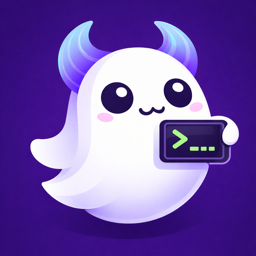

<p align="center">
  
</p>

<h1 align="center">Spectty</h1>

<p align="center">
  An iOS SSH client built on <a href="https://github.com/ghostty-org/ghostty">libghostty-vt</a> with a custom Metal renderer and clean-room Mosh implementation.
</p>

<p align="center">
  
  
  
</p>

## Architecture

```
┌──────────────────────────────────────────────────────┐
│  SwiftUI App Shell                                   │
│  ConnectionList → SessionManager → TerminalSession   │
│  MoshSessionStore (Keychain persistence)             │
└──────────────┬───────────────────────────────────────┘
               │
┌──────────────▼───────────────────────────────────────┐
│  SpecttyUI                                           │
│  TerminalMetalView (MTKView) + Metal glyph atlas     │
│  TerminalView (UIViewRepresentable)                  │
│  InputAccessory, GestureHandler                      │
└──────────────┬───────────────────────────────────────┘
               │ reads state from
┌──────────────▼───────────────────────────────────────┐
│  SpecttyTerminal                                     │
│  VTStateMachine (CSI/SGR/OSC parser)                 │
│  TerminalState (grid, cursor, modes, scrollback)     │
│  KeyEncoder (xterm key sequences)                    │
│  CGhosttyVT (C stubs, swappable for libghostty-vt)  │
└──────────────┬───────────────────────────────────────┘
               │ TerminalEmulator protocol
┌──────────────▼───────────────────────────────────────┐
│  SpecttyTransport                                    │
│  SSHTransport (SwiftNIO SSH)                         │
│  MoshTransport (clean-room Swift)                    │
│    MoshBootstrap (SSH exec → mosh-server)            │
│    MoshSSP (State Synchronization Protocol)          │
│    MoshNetwork (UDP via Network.framework)            │
│    MoshCrypto (AES-128-OCB3 via CommonCrypto)        │
│    STUNClient (NAT traversal diagnostics)            │
│  TerminalTransport / ResumableTransport protocols    │
└──────────────┬───────────────────────────────────────┘
               │
┌──────────────▼───────────────────────────────────────┐
│  SpecttyKeychain                                     │
│  iOS Keychain storage, Ed25519/ECDSA generation,     │
│  Secure Enclave, OpenSSH key import                  │
└──────────────────────────────────────────────────────┘
```

**Data flow:**
```
Keyboard → KeyEncoder → Transport → Remote Server
                                         │
 TerminalMetalView ← TerminalState ← VTStateMachine ← Transport
```

## Packages

| Package | Purpose |
|---------|---------|
| `SpecttyTerminal` | VT100/xterm state machine, cell model, scrollback buffer, key encoder |
| `SpecttyTransport` | SSH (SwiftNIO SSH) and Mosh transports behind `TerminalTransport` protocol |
| `SpecttyUI` | Metal renderer with CoreText glyph atlas, SwiftUI wrapper, input accessory bar, gestures |
| `SpecttyKeychain` | iOS Keychain key storage, Ed25519/ECDSA/Secure Enclave generation, OpenSSH PEM import |

## Key Design Decisions

| Decision | Choice | Why |
|----------|--------|-----|
| Rendering | Metal from day 1 | Performance parity with Ghostty |
| Terminal emulation | Custom Swift + libghostty-vt stubs | Replaceable via `TerminalEmulator` protocol |
| SSH | SwiftNIO SSH | Pure Swift, Apple-maintained, Apache-2.0 |
| Mosh | Clean-room Swift | No GPL dependency; AES-128-OCB3 via CommonCrypto, SSP + protobuf from scratch |
| Persistence | SwiftData | Modern, built-in, iOS 17+ |
| Concurrency | Swift 6 strict | async/await, AsyncStream, actors throughout |
| Key storage | iOS Keychain + Secure Enclave | Hardware-backed, platform standard |
| Session resumption | `ResumableTransport` protocol | Capability-based; app layer doesn't downcast to concrete transport types |
| Network roaming | NWConnection path handlers | Platform-native; viability + better-path triggers UDP connection replacement |

## Mosh Implementation

Clean-room Swift implementation — no GPL code. Key components:

- **MoshBootstrap**: SSH exec → `mosh-server new` → parse `MOSH CONNECT <port> <key>` → close SSH
- **MoshCrypto**: AES-128-OCB3 (RFC 7253) using CommonCrypto's AES-ECB as the block cipher
- **MoshNetwork**: UDP transport via Network.framework with connection replacement for roaming
- **MoshSSP**: State Synchronization Protocol — sequence-numbered diffs with heartbeat/retransmit
- **Session resumption**: Credentials + SSP sequence numbers persisted to Keychain; reconnect skips SSH bootstrap entirely since mosh-server is daemonized
- **STUNClient**: Minimal RFC 5389 Binding Request for NAT type diagnostics

## libghostty Integration

The architecture is designed so libghostty components can be swapped in incrementally:

- **VT parsing**: Replace `VTStateMachine` with libghostty-vt's terminal state C API — `TerminalEmulator` protocol insulates everything else
- **Rendering**: Replace `TerminalMetalRenderer` with libghostty's Metal rendering C API — `TerminalRenderer` protocol insulates everything else

Each swap is independent. No big-bang migration needed.

## Build

Requires Xcode 26.2+, iOS 18+ deployment target.

```bash
xcodebuild build -scheme Spectty -destination 'generic/platform=iOS'
```
